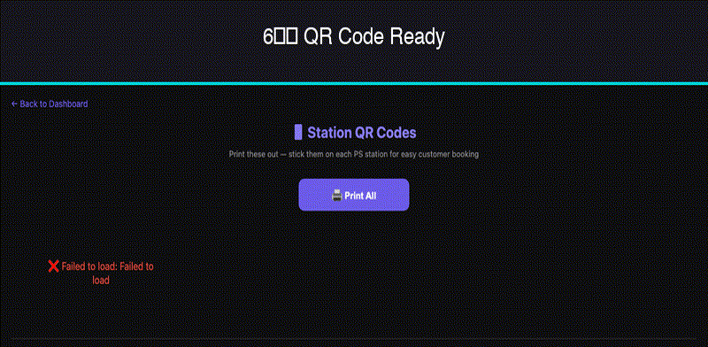

<div align="center">
  <h1>⏱️ OnClock</h1>
  <p><strong>Station Management Platform — Session tracking, billing & monitoring for any station-based business</strong></p>
  <p>
    <a href="#features">Features</a> •
    <a href="#quick-start">Quick Start</a> •
    <a href="#architecture">Architecture</a> •
    <a href="#api">API</a> •
    <a href="#deployment">Deployment</a>
  </p>
  <p>
    
    
    
    
    
    
  </p>
  <p>
    <a href="#features">Features</a> •
    <a href="#quick-start">Quick Start</a> •
    <a href="#architecture">Architecture</a> •
    <a href="#api">API</a> •
    <a href="#deployment">Deployment</a>
  </p>
</div>

---

OnClock is a **production-ready session management platform** for any business with bookable stations, slots, or units. It handles the full lifecycle — customer booking → live timer → billing → owner monitoring — so you don't have to build any of it.

Customers access it from any phone — share the link via **QR code, SMS, WhatsApp, a shared tablet/kiosk, NFC tag, or just a printed URL**. The web app works on any device with a browser.

---

## 🎥 Demo



---

## 🏢 Use Cases

### 🎮 Gaming Lounges
*Manage PlayStation/PC stations with hourly billing.*
> Customers open a link on their phone, pick a station, pay via UPI. Live countdown shows remaining time. Owner sees all active sessions, extends or ends sessions, tracks revenue. Per-player billing for group bookings.

### 🖥️ Co-working Spaces
*Desks, meeting rooms, and phone booths by the hour.*
> Members open a link to book a desk, the timer runs while they're checked in, and billing auto-calculates. Owner sees occupancy rates, frequent members, and revenue.

### 🧺 Laundry Mats
*Washing machines and dryers on a timer.*
> Customer picks a machine on their phone, pays for the cycle duration. Timer counts down. When it ends, the next customer can start. Owner sees machine utilization and maintenance needs.

### 🚗 Car / Bike Wash Bays
*Wash bays with time-based pricing.*
> Customer books a bay from their phone, pays for 15/30/60 min, timer tracks their usage. Extend if needed. Owner monitors all bays from one dashboard.

### 🏋️ Gyms & Fitness Studios
*Equipment slots, court bookings, class slots.*
> Members reserve equipment or courts. Timer tracks usage duration. Owner sees peak hours, member visit patterns, and revenue per slot.

### 📦 Rental Operations
*Any time-based rental — tools, cameras, party equipment.*
> Each rental item is a station. Customer books, pays, timer runs. Owner tracks inventory, returns, and overdue items.

### 🎱 Pool / Snooker Halls
*Tables by the hour.*
> Each table is a station. Players book, pay, timer runs. Owner manages all tables from one dashboard — start, extend, end sessions.

### 🏠 And Anything With Slots
*Any business where customers pay for time in a specific spot.*
> Barber chairs, massage rooms, karaoke booths, study rooms, photography studios, music practice rooms — if you charge by time per unit, OnClock works.

---

## ✨ Features

### For Customers

| Feature | Description |
|---------|-------------|
| 📱 **Mobile-first booking** | Open a link, pick a station, choose duration, pay via UPI — works on any phone |
| ⏱️ **Live countdown timer** | Real-time session timer with progress indicator |
| 💳 **UPI Payments** | GPay / PhonePe / Paytm deep links with pre-filled amounts |
| 🆓 **Free buffer time** | +5 min courtesy buffer on every booking |
| 🔄 **Extend from kiosk** | Prepay to extend your session on the spot |

### For Owners

| Feature | Description |
|---------|-------------|
| 🎛️ **Full dashboard** | See all stations, active sessions, revenue at a glance |
| ▶️ **Start sessions** | Start sessions from the dashboard (customer already paid) |
| ⏹️ **End/Extend** | End sessions early, add hours to active sessions |
| 👥 **Per-player tracking** | Individual billing when multiple people share a station |
| 📊 **Customer database** | Track visit history, spend, favourite stations |
| 📅 **Advance booking** | Prepaid slots with conflict detection |
| 🔐 **Password-protected** | Dashboard locked behind password, stored in DB |
| 🔔 **Telegram alerts** | Optional notifications for new bookings |

---

## 🚀 Quick Start

### Prerequisites
- Python 3.12+
- A [Supabase](https://supabase.com) project (free tier works)
- A UPI ID (for payments)

### 1. Clone & Install

```bash
git clone https://github.com/LoneTraderRishi/onclock.git
cd onclock/backend
pip install -r requirements.txt
```

### 2. Set up Supabase

Create a project at [supabase.com](https://supabase.com), then run the migration:

```bash
# Using Supabase CLI
supabase db push --linked

# Or copy the SQL from backend/migrations/001_initial.sql and run it in Supabase SQL Editor
```

### 3. Configure

```bash
cp .env.example .env
# Edit .env with your Supabase URL, key, and preferences
```

### 4. Run

```bash
python main.py
```

Open:
- **`http://localhost:8000`** → Station selection (customer-facing)
- **`http://localhost:8000/dashboard`** → Owner dashboard (password-protected)

---

## 🏗️ Architecture

```
┌──────────────┐     ┌─────────────────┐     ┌──────────────┐
│  Customers   │────▶│   FastAPI App    │────▶│   Supabase   │
│  (Phone/Brw) │     │  (backend/)      │     │  PostgreSQL  │
├──────────────┤     ├─────────────────┤     ├──────────────┤
│  Owner Dash  │────▶│  main.py         │     │  stations    │
└──────────────┘     │  database.py     │     │  sessions    │
                     │  models.py       │     └──────────────┘
                     └─────────────────┘
                           │
                           ▼
                     ┌─────────────────┐
                     │  Telegram Bot    │
                     │  (notifications) │
                     └─────────────────┘
```

- **Backend:** FastAPI (Python) — single `main.py` with clean route organization
- **Database:** Supabase PostgreSQL — `stations` + `sessions` tables
- **Frontend:** Static HTML/CSS/JS — no build step, works on any phone
- **Auth:** Password-based dashboard auth
- **Payments:** UPI deep links (GPay, PhonePe, Paytm)

---

## 🗂️ Project Structure

```
onclock/
├── backend/
│   ├── main.py              # FastAPI app — all routes
│   ├── database.py          # Supabase client
│   ├── models.py            # Pydantic models
│   ├── requirements.txt     # Python dependencies
│   ├── .env.example         # Env vars template
│   ├── migrations/
│   │   └── 001_initial.sql  # Database schema
│   └── frontend/
│       ├── index.html       # Station selection
│       ├── station-menu.html # Booking page
│       ├── track.html       # Live countdown timer
│       ├── dashboard.html   # Owner dashboard
│       ├── customers.html   # Customer database
│       ├── qr.html          # QR code display
│       ├── sw.js            # Service worker
│       └── manifest.json    # PWA manifest
├── README.md
└── LICENSE
```

---

## 📡 API

### Public Endpoints

| Method | Endpoint | Description |
|--------|----------|-------------|
| GET | `/api/stations` | List all stations with status |
| GET | `/api/stations/{id}/status` | Station status (occupied/available) |
| POST | `/api/sessions/start` | Start a new session |
| GET | `/api/sessions/{id}` | Session details + remaining time |
| POST | `/api/sessions/book` | Advance booking |

### Dashboard Endpoints (password protected)

| Method | Endpoint | Description |
|--------|----------|-------------|
| GET | `/api/sessions` | All sessions |
| GET | `/api/sessions/active` | Currently active sessions |
| GET | `/api/sessions/pending` | Pending advance bookings |
| POST | `/api/sessions/{id}/confirm` | Confirm advance booking |
| POST | `/api/sessions/{id}/cancel` | Cancel booking |
| POST | `/api/sessions/{id}/end` | End a session early |
| POST | `/api/sessions/{id}/extend` | Add hours to active session |
| POST | `/api/sessions/{id}/add-player` | Add player to active session |
| GET | `/api/stats` | Revenue & session counts |
| GET | `/api/customers` | Customer database |
| POST | `/api/stations` | Create a station |
| PUT | `/api/stations/{id}` | Update station config |
| DELETE | `/api/stations/{id}` | Remove a station |

### Frontend Pages

| Route | File | Description |
|-------|------|-------------|
| `/` | `index.html` | Station selection |
| `/booking/{n}` | `station-menu.html` | Booking page |
| `/track` | `track.html` | Live countdown timer |
| `/dashboard` | `dashboard.html` | Owner dashboard |
| `/customers` | `customers.html` | Customer database |
| `/qr-codes` | `qr.html` | QR code display |

---

## 🔧 Environment Variables

| Variable | Required | Default | Description |
|----------|----------|---------|-------------|
| `SUPABASE_URL` | ✅ | — | Supabase project URL |
| `SUPABASE_KEY` | ✅ | — | Supabase anon/service key |
| `DASHBOARD_PASSWORD` | ✅ | `changeme` | Owner dashboard password |
| `BUSINESS_NAME` | — | `My Business` | Business name displayed in UI |
| `HOURLY_RATE` | — | `50` | Default hourly rate (₹) |
| `UPI_ID` | — | — | UPI ID for payments |
| `UPI_PAYEE_NAME` | — | — | Name shown on payment screen |
| `TELEGRAM_BOT_TOKEN` | — | — | Telegram bot token (notifications) |
| `TELEGRAM_CHAT_ID` | — | — | Telegram chat ID for alerts |

---

## 🚢 Deployment

### Self-hosted

```bash
cd backend
pip install -r requirements.txt
python main.py
# Runs on http://localhost:8000
```

---

## 🧪 Tests

```bash
cd backend
pip install pytest pytest-asyncio httpx
python -m pytest tests/ -v
```


---

## 🤝 Contributing

Contributions are welcome! See [CONTRIBUTING.md](.github/CONTRIBUTING.md) for setup and workflow.

1. Fork the repo
2. Create a feature branch (`git checkout -b feature/amazing`)
3. Commit your changes (`git commit -m 'Add amazing feature'`)
4. Push (`git push origin feature/amazing`)
5. Open a Pull Request

---

## 📄 License

[MIT](LICENSE) © Rishi

---

## 🙏 Built With

- [FastAPI](https://fastapi.tiangolo.com/)
- [Supabase](https://supabase.com/)
